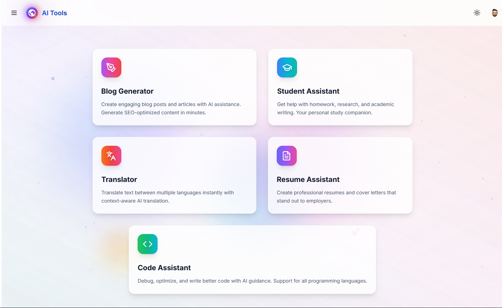
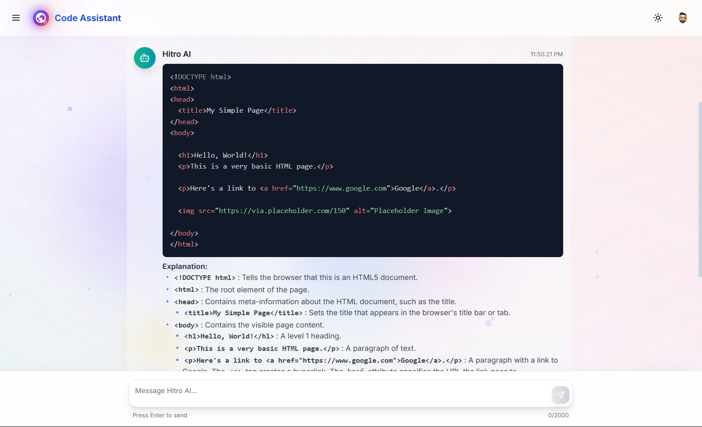
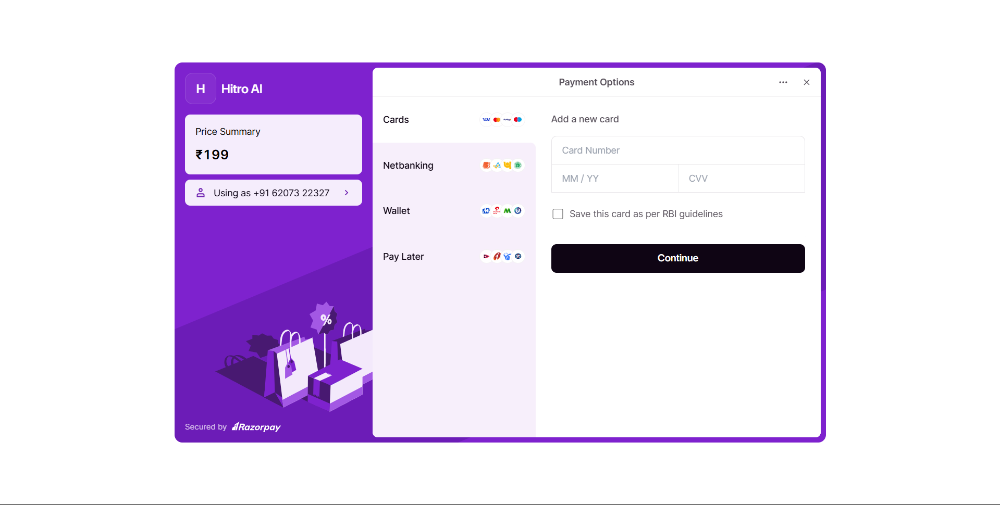
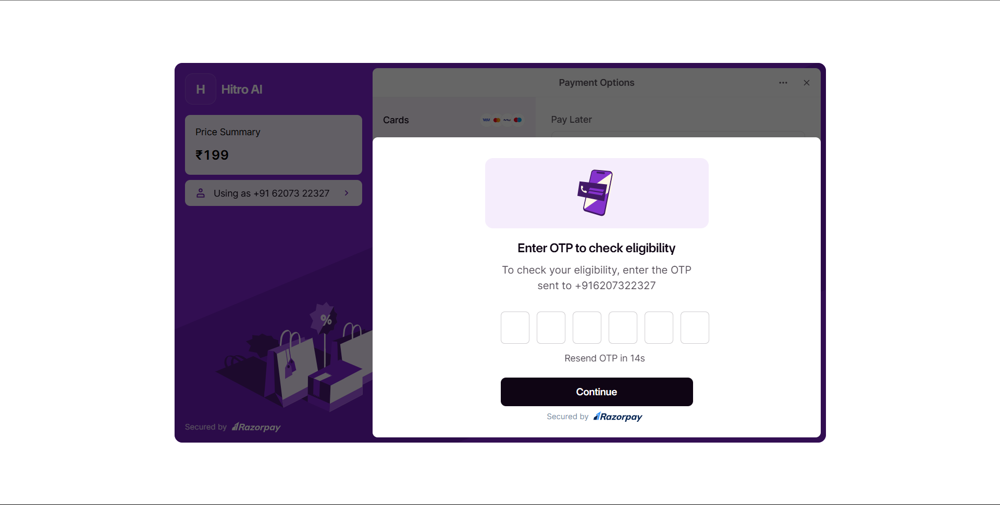
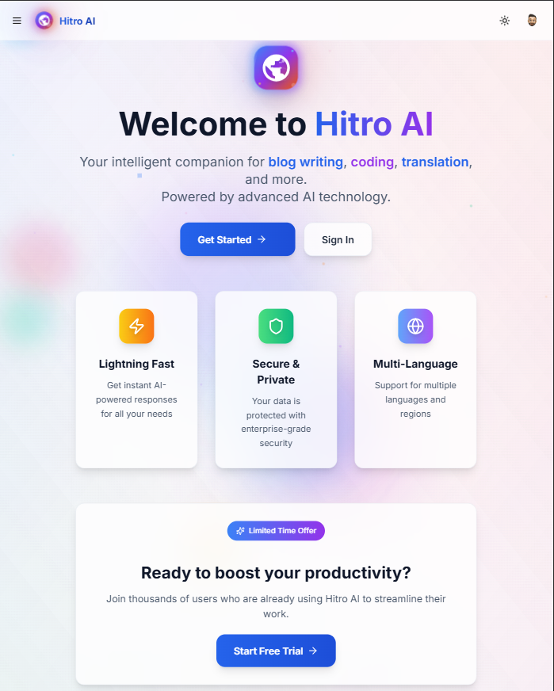
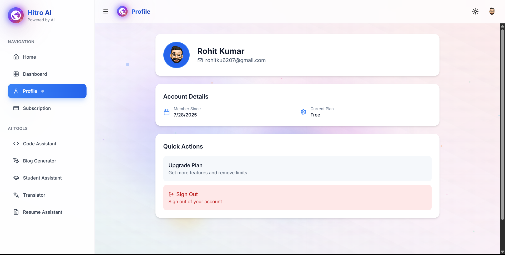
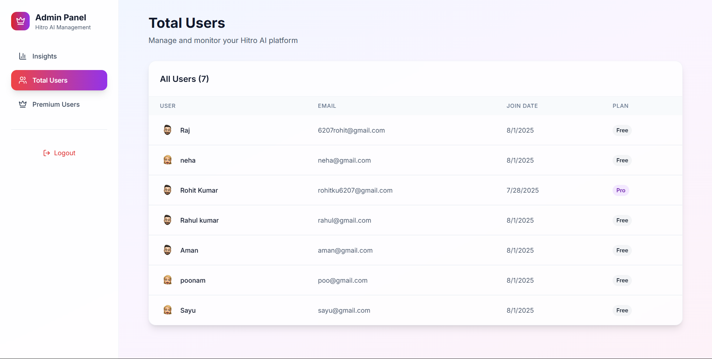
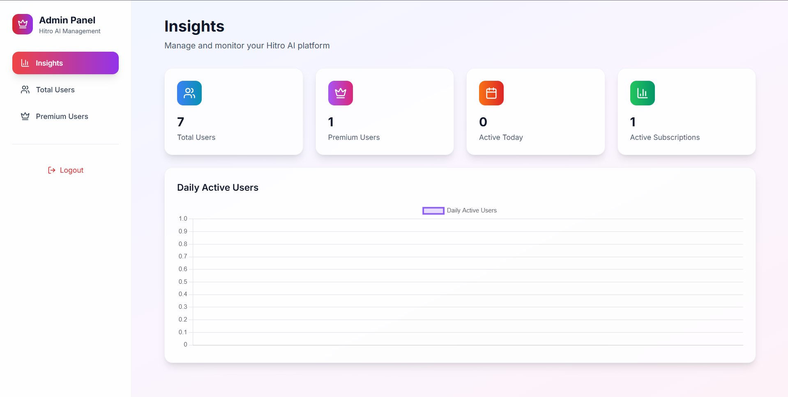

<h1 align="center">🤖 HitroAI – Full-Stack AI-driven Platform</h1>

HitroAI is a comprehensive, full-stack AI-driven SaaS platform designed to streamline productivity across multiple domains. It combines a modern React-based frontend with a robust Laravel backend to deliver fast performance, secure operations, and a smooth user experience. The platform leverages Firebase for real-time authentication and data handling, ensuring instant updates, reliable user management, and seamless cross-device access. Every part of the system is engineered for efficiency — from a modular architecture to a clean, user-friendly UI/UX workflow.

The application offers five advanced AI tools built to solve practical needs such as coding assistance, content generation, student support, translation, and more. Users can toggle light/dark themes, use a powerful admin dashboard for analytics and control, and upgrade to premium features via a secure Razorpay payment flow. With scalable architecture and smart automation, HitroAI is a complete productivity suite for developers, students, writers, and professionals.

---

<h2 align="center">🖼️ Demo Preview</h2>

<h3 align="center">AI Tools</h3>

  
  

<h3 align="center">Razorpay Integration</h3>

  
  

<h3 align="center">Interface</h3>

  
  
  

<h3 align="center">Admin Panel</h3>

  
  

###

<h2 align="center">🎥 Video Demo</h2>

  <!-- Some renderers support <video>; GitHub may not autoplay/inline but will provide the tag if supported. -->
  <video width="800" controls style="max-width:100%;">
    <source src="Preview-image/preview.mp4" type="video/mp4">
    Your browser does not support the video tag.
  </video>

  <!-- Fallback: clickable thumbnail that opens the raw MP4 -->
  

---

<h2 align="center">⚙️ Features & Tech Stack</h2>

<table align="center" style="border-collapse:collapse; max-width:900px; width:100%;">
  <tr>
    <td valign="top" style="text-align:left; padding:16px; border:1px solid #2c2c2c; width:50%;">
      <h3 align="center">Features</h3>
      <ul>
        <li>🔐 <strong>Authentication</strong> – Firebase login/signup (Email & Password)</li>
        <li>🎨 <strong>Themes</strong> – Light and Dark theme toggle</li>
        <li>🤖 <strong>AI Tools (5 Total)</strong>:
          <ul>
            <li>✨ Code Assistant (Gemini API)</li>
            <li>🎓 Student Assistant (Gemini API)</li>
            <li>🌐 Translator (Gemini API)</li>
            <li>📝 Blog Writer (Cohere API)</li>
            <li>📄 Resume Assistant (Cohere API)</li>
          </ul>
        </li>
        <li>📊 <strong>Admin Panel</strong>: Dashboard insights (User & Premium Stats), Users Table, Premium Users Table</li>
        <li>💸 <strong>Razorpay Payment Integration</strong>: Subscription cost: ₹199 — real-time premium status update after payment</li>
        <li>📈 Firebase analytics with real-time usage tracking</li>
      </ul>
    </td>
    <td valign="top" style="text-align:left; padding:16px; border:1px solid #2c2c2c; width:50%;">
      <h3 align="center">Tech Stack</h3>
      <ul>
        <li><strong>Frontend</strong>: React, Tailwind CSS</li>
        <li><strong>State Management</strong>: TanStack Query</li>
        <li><strong>Backend</strong>: Laravel (API-based)</li>
        <li><strong>Database</strong>: Firebase Firestore</li>
        <li><strong>Authentication</strong>: Firebase Auth</li>
        <li><strong>Payment Gateway</strong>: Razorpay</li>
        <li><strong>AI APIs</strong>: Google Gemini & Cohere</li>
      </ul>
    </td>
  </tr>
</table>

---

<h2 align="center">📜 License</h2>

This project is fully developed and copyrighted © 2025 by <strong>Rohit Kumar</strong>.  
Unauthorized copying, redistribution, or commercial use of this source code is strictly prohibited without prior written consent from the author.  
All rights reserved.

---

<h2 align="center">🧑‍💻 Author</h2>

<strong>Rohit Kumar</strong>

<!-- Colorful standalone icons (no shield badges, no websites) -->

&nbsp;&nbsp;&nbsp;

